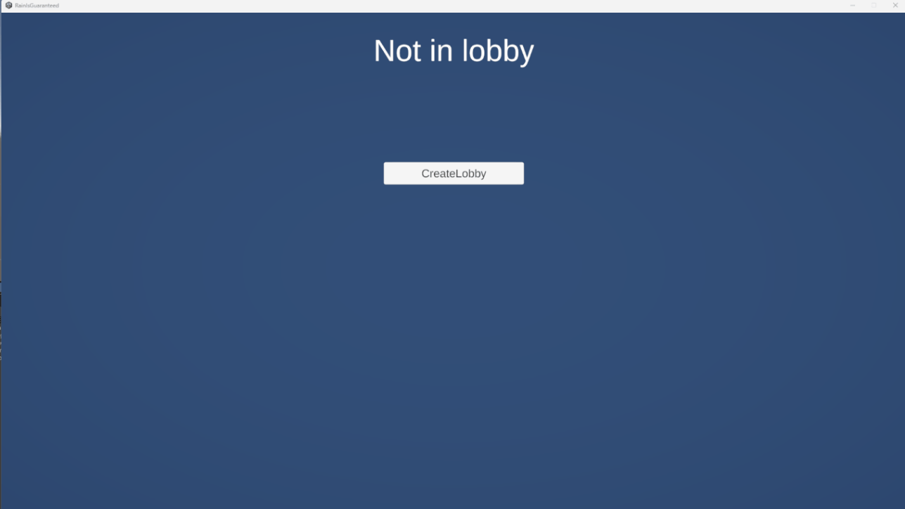
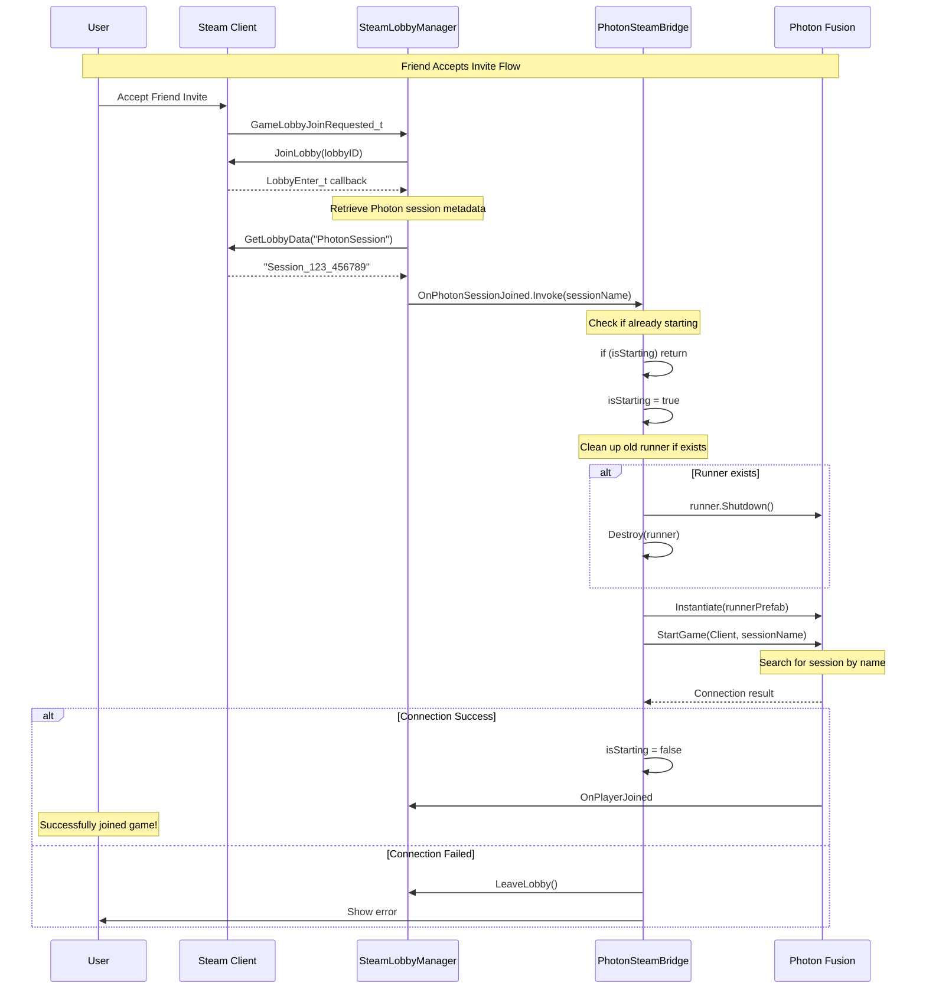

# Steam Integration with Photon Fusion 2


## About
This framework bridges Steam's social features with Photon Fusion 2's networking, allowing players to create lobbies through Steam, invite friends via the overlay, and seamlessly connect to Photon's servers.

The core challenge was synchronizing two fundamentally different systems. Steam lobbies are metadata containers whilst Photon handles actual gameplay networking. I implemented an event-driven architecture where Steam callbacks trigger Photon session creation, with the session name stored as Steam lobby metadata.

## Features Overview

| Category | Feature | Description |
|----------|---------|-------------|
| **Steam Integration** | Lobby Management | Create, join, and leave Steam lobbies with metadata synchronization |
| **Steam Integration** | Friend Invitations | Invite friends through Steam overlay with automatic session joining |
| **Steam Integration** | Avatar Loading | Asynchronous avatar fetching with caching and event-driven UI updates |
| **Photon Fusion** | Session Bridging | Automatic Photon session creation/joining based on Steam lobby state |
| **Photon Fusion** | Host-Client Architecture | Server-authoritative networking with host validation |
| **UI System** | Player List | Real-time player list with Steam avatars and host indicators |
| **UI System** | Scene Persistence | DontDestroyOnLoad pattern with dynamic reference resolution |
| **Architecture** | Event-Driven Design | Loose coupling between Steam and Photon systems via UnityEvents |

## Implementation Details

### Steam Lobby Management
The Steam lobby system acts as the social layer, handling friend invitations and player discovery. When a host creates a lobby, the system generates a unique Photon session name and stores it as Steam lobby metadata:
```csharp
string photonSessionName = $"Session_{SteamID}_{DateTime.Now.Ticks}";
SteamMatchmaking.SetLobbyData(currentLobbyID, "PhotonSession", photonSessionName);
```

 
*Example of creating a lobby and inviting friends through Steam overlay*

**Key Components:**
- `SteamLobbyManager.cs` - Handles all Steam callback registration and lobby operations
- Callback-driven architecture using `Callback<T>.Create()` pattern
- Metadata synchronization between Steam and Photon systems

### Photon Session Bridge
The bridge component listens for Steam lobby events and translates them into Photon session operations. When a friend accepts a Steam invite:

1. Steam triggers `GameLobbyJoinRequested_t` callback
2. Client joins Steam lobby via `JoinLobby()`
3. `LobbyEnter_t` callback retrieves Photon session name from lobby metadata
4. Bridge automatically calls `NetworkRunner.StartGame()` with retrieved session name

### Join Flow Sequence


**Technical Challenges Solved:**
- Preventing multiple simultaneous session starts with `isStarting` flag
- Cleaning up old NetworkRunners before creating new ones
- Synchronizing shutdown between both systems

### Avatar Loading System
The section I'm most proud of is the avatar loading system. Steam provides profile images asynchronously through the `GetLargeFriendAvatar()` API, which returns:
- `-1` = Avatar not ready (downloading)
- `0` = No avatar available
- `>0` = Avatar handle for immediate retrieval

I implemented a caching system with event callbacks:
```csharp
private Dictionary<CSteamID, Texture2D> avatarCache;
public System.Action<CSteamID, Texture2D> OnAvatarLoaded;
```

When an avatar finishes downloading, `AvatarImageLoaded_t` callback fires, triggering all subscribed UI elements to update automatically without manual polling.


**Implementation Highlights:**
- Placeholder avatars shown during download
- Singleton pattern for global access
- Y-axis pixel flipping (Steam provides top-down, Unity expects bottom-up)

### UI Persistence System
The DontDestroyOnLoad persistence pattern created interesting challenges. UI elements survive scene transitions but references to scene objects break. I solved this with dynamic reference resolution:
```csharp
private void OnSceneLoaded(Scene scene, LoadSceneMode mode)
{
    FindLobbyManager();           // Re-find reference
    FindPlayerListContainer();    // Re-find UI container
    InitializeUI();               // Re-wire all connections
}
```


**Edge Cases Handled:**
- Multiple EventSystems across scenes (auto-cleanup)
- UI container references breaking after scene load
- Button listener duplication prevention

### Event-Driven Architecture
The entire framework uses UnityEvents for loose coupling:
```
Steam Lobby Created
    ↓
OnPhotonSessionCreated.Invoke(sessionName)
    ↓
PhotonSteamBridge.OnSteamLobbyCreated()
    ↓
NetworkRunner.StartGame(Host, sessionName)
```

This design allows:
- Easy extension without modifying core systems
- Multiple listeners on the same events
- Clean separation between Steam, Photon, and UI layers

## Project Structure
```
Scripts/
├── Steam/
│   ├── SteamManager.cs              # Steam API initialization
│   ├── SteamLobbyManager.cs         # Lobby creation, joining, callbacks
│   └── SteamAvatarLoader.cs         # Async avatar loading with caching
├── Photon/
│   └── PhotonSteamBridge.cs         # Translates Steam events to Photon operations
└── UI/
    ├── LobbyUI.cs                   # Main lobby interface controller
    ├── LobbyMemberUI.cs             # Individual player entry display
    └── LobbyMemberData.cs           # Player data container
```

## Setup Instructions

### Prerequisites
- Unity 2021.3 or later
- Steamworks.NET SDK ([GitHub](https://github.com/rlabrecque/Steamworks.NET))
- Photon Fusion 2 SDK
- Valid Steam App ID

### Installation
1. Clone the repository
2. Import Steamworks.NET into your Unity project
3. Import Photon Fusion 2 SDK
4. Create `steam_appid.txt` in project root with your Steam App ID
5. Configure Photon App ID in Fusion settings

### Quick Start
```csharp
// 1. Attach SteamManager to persistent GameObject
// 2. Attach SteamLobbyManager to persistent GameObject
// 3. Setup PhotonSteamBridge with references
// 4. Configure LobbyUI with button references
// 5. Assign NetworkRunner prefab to bridge
```

## Testing
Testing required running multiple game instances simultaneously. I used the following workflow:

1. **Host Test:**
   - Launch instance 1
   - Create lobby
   - Verify Steam lobby appears in Steam overlay
   - Check Photon session creation logs

2. **Client Test:**
   - Launch instance 2
   - Accept Steam invite from host
   - Verify automatic Photon session join
   - Confirm player list updates on both clients

3. **Edge Case Tests:**
   - Leave lobby → rejoin → verify cleanup
   - Scene transitions during active lobby
   - Multiple rapid invite accepts

## Known Limitations
- Currently only supports Windows platform (Steamworks.NET requirement)
- Maximum 8 players per lobby (configurable)
- No reconnection logic for dropped connections
- EventSystem conflicts require manual cleanup in complex projects

## Future Improvements
Looking forward, I'd like to implement:

- **Steam Rich Presence API** - Display detailed game state on friends' profiles
- **Steam Networking Transport** - Alternative to Photon cloud for LAN sessions
- **Lobby Browser** - Public lobby discovery without friend invites
- **Reconnection System** - Automatic rejoin after connection drops
- **Cross-platform Support** - Extend beyond Windows using SteamAPI alternatives

## Performance Considerations
- Avatar caching prevents redundant Steam API calls
- EventSystem singleton pattern eliminates input conflicts
- Async avatar loading doesn't block main thread
- Minimal overhead: ~0.1ms per frame for Steam callbacks

## License
MIT License - See LICENSE file for details

## Acknowledgments
This framework was developed as a reusable solution for multiplayer Unity projects requiring both Steam social features and robust server-authoritative networking.

**Libraries Used:**
- [Steamworks.NET](https://github.com/rlabrecque/Steamworks.NET) by Riley Labrecque
- [Photon Fusion 2](https://www.photonengine.com/fusion) by Exit Games


---

*For questions or issues, please contact me at [Oliverlieee@gmail.com]*
